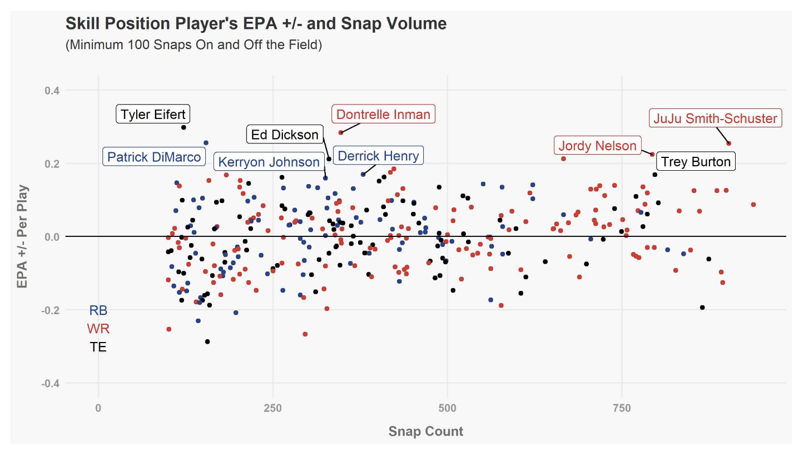

# Assignment 3 & 4: Critique by Design

### Part 1. Find a data visualization

> Photo by <a href="https://www.sharpfootballanalysis.com/analysis/epa-plus-minus-jj-watt-juju-smith-schuster/)https://www.sharpfootballanalysis.com/analysis/epa-plus-minus-jj-watt-juju-smith-schuster/">Sharp Football Analysis</a>

I chose to critique this visualization because I am very interested in sports data and analytics, especially football. Sports data visualizations can often be difficult to understand and sometimes missleading so I chose an example of one to critique and redesign. This graphic certainly fits the mold of being hard to understand, even for its intended audience of football fans and analysts. I wanted to redesign this graphic to make it more accessible to a general audience and show that even obscure sports statistics can be easily understood with the right visualiation.

### Part 2. Critique the data visualization

  Usefulness: 6
  
  Completeness: 4
  
  Perceptibility: 4
  
  Truthfulness: 7
  
  Intuitiveness: 4
  
  Aesthetics: 4
  
  Engagement: 5
  

**Describe your overall observations about the data visualization here.  What stood out to you?  What did you find worked really well?  What didn't?  What, if anything, would you do differently?** 

My initial observation on the data visualization was that nothing immediately stood out. I couldn't really understand the message that the visualization was trying convey until I read the write up below. The use of a scatter plot appears appropriate for plotting the data points, but the number of condensed data points and player names makes the graph appear cluttered and disorganized. I find that the categorical blue-red-black color palette for distinguishing categories works well. I also like how the x and y axis and gridlines are subtle and don't detract from the data. In other words they blend into the background well. I don't like how the visualization lacks a clear message/key trend and how it lacks a clear ranking of players. It's hard to tell which data points are the most "valuable." I would change this by adding a clear upshot, look at displaying "higher ranking" data points in a different way, and add a table that lists the top players by rank. I would also potentially look at trends per category to see if any interesting trends exist. 

**Who is the primary audience for this tool?  Do you think this visualization is effective for reaching that audience?  Why or why not?**

The primary audience for this tool are football fans and analytics that understand advanced statistics/metrics. This is evident due to the use of statistical measurements and acronyms that are not well defined, along with player names provided without much context. This visualization is relatively effective for its targeted audience who are already familiar with the football terms, statistics, and players named in the visualization. However, even for that intended audience, the visualization is clunky and no significant trend trend jumps off the chart. It's hard to immediately understand which data points are ranked higher than others and what the purpose behind the visualization is.

**Final thoughts: how successful what this method at evaluating the data visualization you selected? Are there measures you feel are missing or not being captured here?  What would you change?  Provide 1-2 recommendations (color, type of visualization, layout, etc.)**

This method was generally effective at evaluating the data visualiation. The seven categories provided lots of angles to analyze the graphic from and I thought that all were necessary and important. I would consider adding organization as another category in order to capture more of the formatting approach. 

Overall, this visualization does a poor job of showing any key trends/takeaways from the data. While the graph's intended audience will likely be able to understand it, even they will have difficulty understanding the purpose and meaning behind it upon first observation. My first recommendation would be to change the layout to reduce clutter and show clear trends. This would include changing the color and format/size of the data points to show clear rankings of the data. I would also remove the name text from the graph and add a table ranking the top players to further illustrate the visualization's story. My second recommendation would be to make the chart accessible to a  more general audience, which I would accomplish by adding a descriptive legend that explains the statistical values and a clear summary/upshot to clearly explain what the graph is depicting. Combining these two recommendations will create a more organized and visually appealing visualization that tells a clear story about the data.

### Part 3. Sketch out a solution

For my initial solution, I chose to reuse the aspects of the visualization that I liked, specifically the scatter-plot format, the formatted x and y-axis, and the subdued gridlines. I decided the change the color palette to reflect negative to positive values (red-green gradient) instead of categorizing the different types of skill position players. I also decided to increase the size of the larger value data points to highlight their importance so that upon first observation, anyone should be able to intuit that the large, green data points are "better" than the small, red data points. Next, I chose to place the ranking of top players by skill position in a table to the right side of the graph instead of having the text on the screen to reduce clutter. I then added a legend that displays the color palette for different EPA value ranges. Lastly  remade the title and added text below it that eplained what the statistical metrics being used were and what they meant in terms of the graphic. All of these steps were made to reduce clutter, improve organization, and make the visualization easier to understand to a broader audience. 

### Part 4. Test the solution

I conducted interviews with one student, mid 20's and one working professional, mid 30's. I asked them both these questions: "What is your first observation?", "Can you describe to me what the graphic is telling you?", "What do you like about it?", "What would you change?"

**First response:**

"My first observation is that the colors are nice and visually appealing." , "The graphic is a scatter chart that shows that player performance using EPA over snap count. I'm not quite sure what that is but I see that you have a description above the chart that explains it." , "I like the use of larger bubbles and colors to show which points have higher values. I like how clean the graphic is, it looks pretty organized." , "I would think about making the negative, red data points larger bubbles as well to mirror the green points. I would also point out the top performers on the chart, bascially point to the exact data points becasue there aren't too many of them."

**Second response:**

"This graphic is well organized and the data points stand out more than the lines" , "This graph is comparing data points. The larger, green points are more significant than the red points. There appears to be a mean line in the center?" , "I like the color scheme and how clean everything is. It helps to seperate all of the data points" , "You should explain that snap count an plays are the same thing so that the axis' titles match. But overall it looks really good."

**Takeaways from feedback:**

My main takeaways from the feedback is that I will definitiely sustain the color scheme and size differences. Both interviewes noticed the trends of the graph that I wanted to communicate, which is very good. I will keep the graph clean and uncluttered, but I will add in the names of the top players to the graph. 

### Part 5. Build your solution

  

