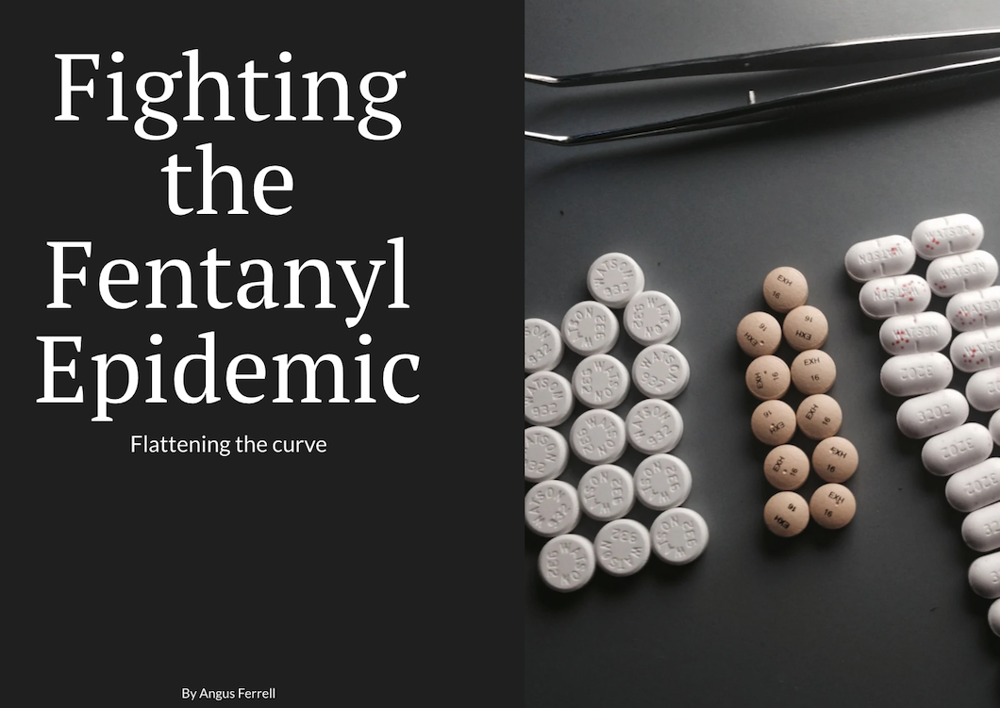

# portfolio
This portfolio contains data visualizations from Telling Stories With Data

# About me
## 👋 Hello, I'm Angus Ferrell

## 📚 Aspiring Data Scientist | 🤖 Machine Learning Enthusiast | 📊 Data Explorer

🌟 About Me: 

📊 Data Science Student: Currently pursuing a graduate degree from Carnegie Mellon's MISM-BIDA program, I'm passionate about the transformative power of data and its ability to drive informed decision-making.

🤖 Machine Learning Enthusiast: I thrive on exploring the exciting world of machine learning, creating predictive models and learning algorithms to solve interesting and unique problems.

🔍 Data Explorer: I enjoy the thrill of uncovering new insights from data. Whether it's through data visualization or statistical analysis, I'm always searching for meaningful patterns.

💡 Lifelong Learner: Continuous learning is a state of mind, not just simply a task. I'm constantly enhancing my skills and staying up-to-date with the latest advancements in data science.

🚀✨ Join me on my data-driven journey as I explore, create, and innovate using unique data visualizations!

Connect with me on LinkedIn: [[LinkedIn Profile](https://www.linkedin.com/in/angusferrell)](https://www.linkedin.com/in/angusmferrell/)

**I used ChatGPT to help format this section in a more creative way**

# What I hope to learn

1. Learn **effective and powerful** tools to leverage data visualizations to illustrate results and conclusions from data 
2. Create **clear and convincing** data visualizations using Tableau
3. Craft this portfolio into a repository of data visualization masterpieces
4. Upon graduation, I intend to work as a data scientist for the US Army's Artificial Intelligence Integration Center.

# Portfolio

## In-class Examples

### 1. Tangled Lines

> Photo by Angus Ferrell

### 2. King County Demo

[King County Demo on flourish](https://angusmf1.github.io/portfolio/kingcountydemo1.html)

### 3. Tableau exercise 

[Trust in news organizations](/mediatrust.md)

## Assignment: [Visualizing Government Debt](/dataviz2.md)

[Visualizing Government Debt repository](/dataviz2.md)

## Assignment 3&4: [Critique by Design](/CritiqueByDesign.md)
For this assignment, make sure you set up and link to a new page.  This page is linking to a new Markdown document called `critique-by-design.md`.  

https://angusmf1.github.io/portfolio/CritiqueByDesign.html 

## Final project: Fighting the Fentanyl Epidemic
My final project focuses on the ongoing fentanyl epidemic in the United States. It provides a brief overview and description of fentanyl and provides visualizations that highlight the alarming growth of fentanyl-related overdose deaths and death rates. It then covers the growing illicit fentanyl trafficking and drug seizures into the United States, highlighting morbid facts and statistics. It uses a map visualization to illustrate where exactly fentanyl is entering the country by rank order. Finally, the presentation highlights harm reduction and other resources. It provides a call to action that inspires the audience to support and spread awareness for harm reduction resources, sign petitions against fentanyl, and support ongoing legislation. 

| [final project I](final_project_angusferrell.md) | [final project II](final_project_angusferrell_part2.md) | [final project III](final_project_angusferrell_part3.md) |

### The final data story
> Visit the Shorthand link below:

