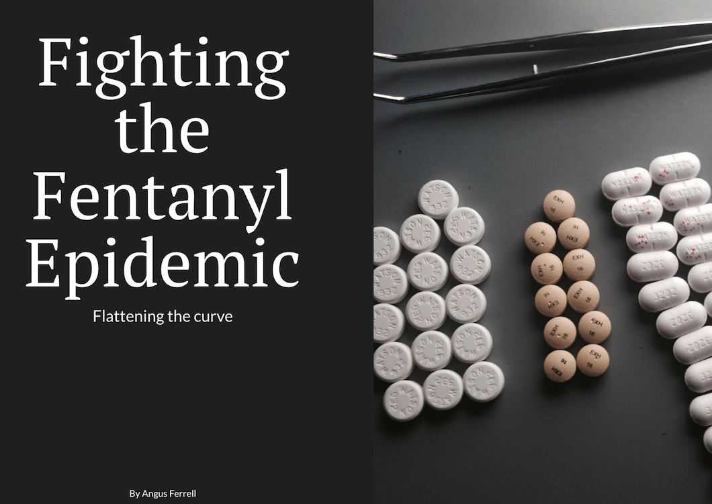

# Final Project: Fighting the Fentanyl Epidemic 

## Part 2: Final project wireframes / storyboards and user research

| [home page](https://github.com/angusmf1/portfolio/) | [visualizing debt](dataviz2.md) | [critique by design](CritiqueByDesign.md) | [final project I](final_project_angusferrell.md) | 

## Wireframes / storyboards
> Visit the Shorthand link below:

## User research 

### Target audience
> My approach to identifying my target audience

The target audience that I hope to reach with my story are every concerned American citizen. This includes students, parents, siblings, friends, and co-workers. My approach to identifying representative individuals to interview were finding three people that fall somewhere in these categories. I selected a parent/artist in their 50's, a working professional in their 30's, and a student in their 20's.

### Interview script
> The goals from research and related questions:

| Goal | Questions to Ask |
|------|------------------|
|Find the audience's perception of fentanyl | What is your perception of fentanyl in the United States?|           
|Find the audience's initial obervations of my shorthand storyboard | What is your first obersvation?  |
|Is my call to action clear? | Can you describe to me what the purpose of the visualization was? |
|What should I keep/what works well?  | What do you like about it? |
|What should I change?  | What would you change? |

## Interview findings
> The findings from my interviews and key takeways

| Questions               | Interview 1                    | Interview 2 | Interview 3 |
|-------------------------|--------------------------------|-------------|-------------|
|What is your perception of fentanyl in the United States? |  Fentanyl is an epidemic in the USA and an emergency issue that needs to be dealt with immediately. The overdoses and the mixing of it into other drugs as wells as over the counter pharmaceuticals is a huge issue. Many people are exposed without intent.  |  Fentanyl is horrible, it's a hidden drug used to lace other drugs. It doesn’t get the attention that it should. People are masking it with opioids, when fentanyl is the real killer. | Fentanyl can be very harmful for people and can impact people’s lives and health drastically. It is highly addictive and can be fatal with even a small amount.             |
|What is your first observation? |  The presentation visually guided me through the written material. The graphs which impacted my understanding of the content the most were the graph of the overdoses and then the graph which expanded as I scrolled down through the topics.| Very aesthetically pleasing. The graphics made me want to continue scrolling through it.| The visualization put a great perspective on how problematic fentanyl is on an a national level. |             
|Can you describe to me what the purpose of the visualization was?   | As a visual learner I understand that information communicated in multiple forms is better absorbed by the reader. Not only were there many on point photos of the topic being explored, the visuals had an interactive and animated component |To educate and raise awareness about fentanyl. This inspires me to spread awareness of fentanyl and its dangers, as well as promote harm reduction. | To give a demonstration on how different places across the United States are effected by the drug use and by black market deals. The presentation provided petitions and laws to support. |
|What do you like about it? | I like the depth of the presentation complete with qualitative data, yet also real life examples of the complexity of the situation all conveyed visually. I like the design of the dark, urban concrete look. The map of the USA with the trafficking route also make a great interactive element  | The callout and the graphics work well together. I like the simplicity of the graphics, not over saturated or too crowded with information. I love that it’s dark and moody, that fits the theme well. I like the format of the text and graphics together, it's easy to read and view the graphs simultaneously. | I like how the presentation was very straight to the point, demonstrating the key information related to the overlying issues with the use and addiction problems of fentanyl. There wasn't any element that seemed redundant or out of place. |
|What would you change?  | The only thing I might add if possible would be a short video of a victim or expert in the subject just to bring even further depth to the information  |  Fix "Difference in Drug Seizure Weight" graph, the zero’s make it seem incomplete or that it’s not showing correctly. Take out the “Follow the Fentanyl Flow” intro text. Add a section for harm reduction, it should be highlighted more these days to help reduce overdoses. | If I had to change anything it would be to incorporate more quotes from either experts explaining in simple terms how problematic this issue is or even people use were addicted to the drug in the past. You could use quotes from fentanyl survivors as well.|

## Identified changes for Part III
> Here are the changes I plan on implementing for part III
> 

| Research synthesis                       | Anticipated changes for Part III                                                |
|------------------------------------------|---------------------------------------------------------------------------------|
| I found that I should add a section for harm reduction | I can add in links to critical resources for addicts, and potentially tie this section in to the personal anecdotes. |       | The dark, urban theme works well   | I will work on polishing up my shorthand presentation, but I will keep that visual theme at the center of it|                                    | I need to add a personal anecdote/account | I don't think adding a video is necessary, but adding personal stories and/or experiences would add a powerful emotional undertone to the presentation and make my call to action for pursuasive. |    
| I found that I need to fix the "Difference in Drug Seizure Weight" visualization | I will remove the zero's make the visual appear more polished and not imcomplete |
| I found that I need to remove the "Follow the Fentanyl Flow" intro text from the map. | It is unnecessary an can probably be displayed better by a text overhead above | 

### Final thoughts 

My Shorthand presentation is coming along nicely and is almost complete. The narrative structure of setup, conflict, and resolution appears to be in place well. The quality and structure of my presentation draws my audience's interest and convinces them to want to read more. The dark and moody theme works in concert with the graphics to create a good flow that's not too clunky or crowded. I will add a personal anecdote to add a deeper emotional element to the story and make my call to action more persuasive. 

